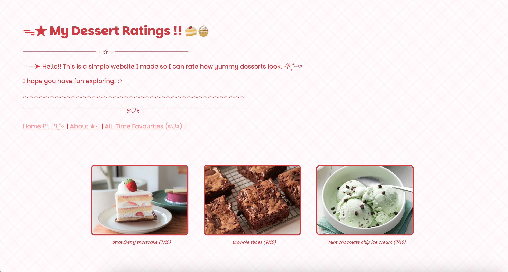
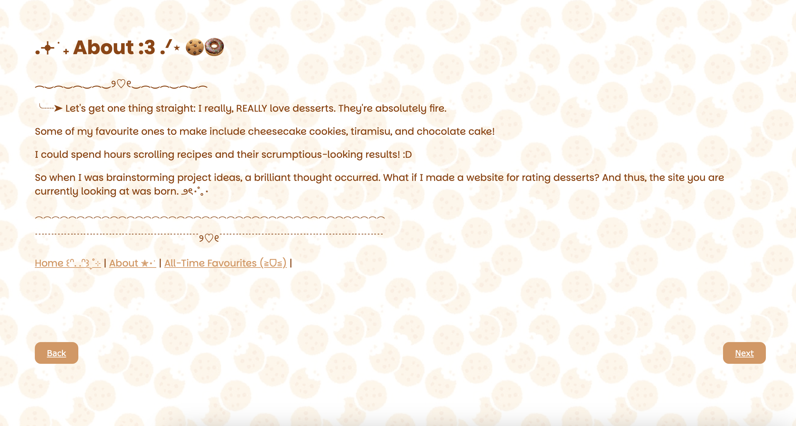
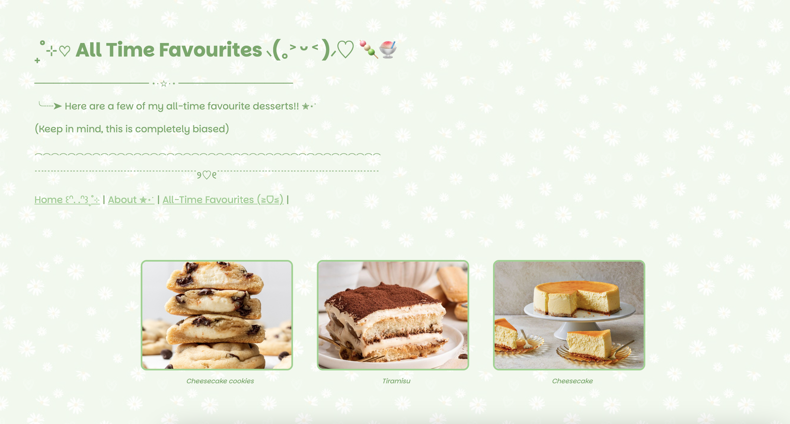

# This project is called Dessert Rater! 

### What my project is/does:
> It's a simple site where I can rate desserts and how delicious they look.
> I added pages for the "About" section and the "All-Time Favourites" section.
> Here are some screenshots!
> 
> 
> 
> 

### How you can view my project
> Click here: https://zarazahed.github.io/dessert-website/index.html

### Why I made my project:
> Lately, I've been really craving desserts!
> While I was brainstorming ideas for a website, I thought, "Hey, why not make a site for rating how delicious desserts look?"

### How I made my project
> I used HTML and CSS to make the site!
> I added a few unplanned additions along the way, including the "All-Time Favourites" section.

### What I struggled with and what I learned:
> I struggled with placing the "Next" and "Back" buttons next to each other.
> I also had some issues with the rows of images.
> But at the end, I was able to solve both!

#### Credits
> Images from Google and website design inspired by ideas from Pinterest
